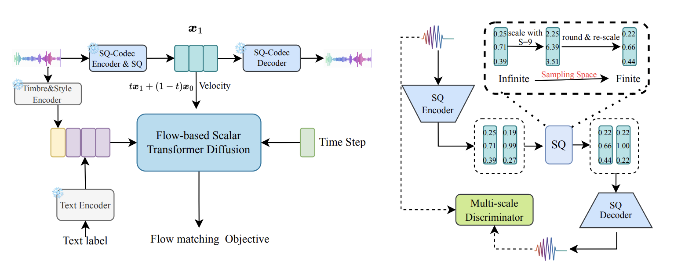

# 
 SimpleSpeech 2: Towards Simple and Efficient Text-to-Speech with Flow-based Scalar Latent Transformer Diffusion Models 

 Dongchao Yang, Yuanyuan Wang, Haohan Guo, Rongjie Huang, Dading Chong, Songxiang Liu, Xixin Wu, Helen Meng 
 

 The Chinese University of Hong Kong 

## Introduction
Scaling Text-to-speech (TTS) to large-scale datasets has been demonstrated as an effective method for improving the diversity and naturalness of synthesized speech. At the high level, previous large-scale TTS models can be categorized into either Auto-regressive (AR) based (\textit{e.g.}, VALL-E) or Non-auto-regressive (NAR) based models (\textit{e.g.}, NaturalSpeech 2/3). Although these works demonstrate good performance, they still have drawbacks. For instance, AR-based models are plagued by unstable generation quality and slow generation speed; meanwhile, some NAR-based models need phoneme-level duration alignment information, thereby increasing the complexity of data pre-processing, model design, and loss design. In this work, we extend our previous publication and implement a simple and efficient NAR TTS framework, termed SimpleSpeech 2. SimpleSpeech 2 effectively combines the advantages of previous AR-based and NAR-based methods, includes (1) simple data preparation; (2) simple model and loss design; (3) stable and high-quality generation performance while fast generation speed.
Compared to our previous publication, we present ({\romannumeral1}) a detailed analysis of the influence of speech tokenizer and noisy label for TTS performance; ({\romannumeral2}) four distinct types of sentence duration predictors; ({\romannumeral3}) a novel flow-based scalar latent transformer diffusion model. With these improvement, we show a significant improvement in generation performance and generation speed compared to our previous work and other state-of-the-art (SOTA) large-scale TTS models. Furthermore, we show that SimpleSpeech 2 can be seamlessly extended to multilingual TTS by training it on multilingual speech datasets.

## Overview
The overview of SimpleSpeech 2 as following picture shows.

In the following, we will show some generated samples by our proposed method. 

## Zero-shot TTS.
In the following, we first show some case in Common voice, VCTK, RAVDESS, SwitchBoard and LibriTTS test clean set. We compare with VALL-EX, VoiceCraft, NaturalSpeech 2/3, ChatTTS, HierSpeech++, and XTTS

| 
  Content (The transcirption of the target audio) 
                        | 
 Prompt 
 | 
 GT Speech 
| 
 VALL-EX 
| 
 VoiceCraft 
 | 
 NaturalSpeech 2 
 | 
 NaturalSpeech 3 
 |
 ChatTTS 
 | 
 HierSpeech++ 
 |  
 XTTS 
 | 
 Ours 
 | 
|---------------------------------------------------------------------------------------|--------|-----------|---------|------------|-----------------|-----------------|---------|--------------|------|------|
| We don't have the budget to produce it in studio quality. | <audio class="audio-player2" src="compare_baseline_mos/ref2/common_voice_en_13900-common_voice_en_13901.wav" controls preload></audio>   | <audio class="audio-player2" src="compare_baseline_mos/gt/common_voice_en_13900-common_voice_en_13901.wav" controls preload></audio> | <audio class="audio-player2" src="compare_baseline_mos/vallex/common_voice_en_13900-common_voice_en_13901.wav" controls preload></audio> | <audio class="audio-player2" src="compare_baseline_mos/VoiceCraft/common_voice_en_13900-common_voice_en_13901.wav" controls preload></audio> | <audio class="audio-player2" src="compare_baseline_mos/ns2/common_voice_en_13900-common_voice_en_13901.wav" controls preload></audio> | <audio class="audio-player2" src="compare_baseline_mos/ns3/common_voice_en_13900-common_voice_en_13901.wav" controls preload></audio> | <audio class="audio-player2" src="compare_baseline_mos/chattts/common_voice_en_13900-common_voice_en_13901.wav" controls preload></audio> | <audio class="audio-player2" src="compare_baseline_mos/HierSpeechpp/common_voice_en_13900-common_voice_en_13901.wav" controls preload></audio> |  <audio class="audio-player2" src="compare_baseline_mos/xTTS/common_voice_en_13900-common_voice_en_13901.wav" controls preload></audio> |  <audio class="audio-player2" src="compare_baseline_mos/simplespeech2/common_voice_en_13900-common_voice_en_13901.wav" controls preload></audio> |   
| Large brown dog walks up a blue staircase. | <audio class="audio-player2" src="compare_baseline_mos/ref2/common_voice_en_15265-common_voice_en_15266.wav" controls preload></audio>   | <audio class="audio-player2" src="compare_baseline_mos/gt/common_voice_en_15265-common_voice_en_15266.wav" controls preload></audio> | <audio class="audio-player2" src="compare_baseline_mos/vallex/common_voice_en_15265-common_voice_en_15266.wav" controls preload></audio> | <audio class="audio-player2" src="compare_baseline_mos/VoiceCraft/common_voice_en_15265-common_voice_en_15266.wav" controls preload></audio> | <audio class="audio-player2" src="compare_baseline_mos/ns2/common_voice_en_15265-common_voice_en_15266.wav" controls preload></audio> | <audio class="audio-player2" src="compare_baseline_mos/ns3/common_voice_en_15265-common_voice_en_15266.wav" controls preload></audio> | <audio class="audio-player2" src="compare_baseline_mos/chattts/common_voice_en_15265-common_voice_en_15266.wav" controls preload></audio> | <audio class="audio-player2" src="compare_baseline_mos/HierSpeechpp/common_voice_en_15265-common_voice_en_15266.wav" controls preload></audio> |  <audio class="audio-player2" src="compare_baseline_mos/xTTS/common_voice_en_15265-common_voice_en_15266.wav" controls preload></audio> |  <audio class="audio-player2" src="compare_baseline_mos/simplespeech2/common_voice_en_15265-common_voice_en_15266.wav" controls preload></audio> |   
| One by one, the campfires were extinguished, and the oasis fell as quiet as the desert. | <audio class="audio-player2" src="compare_baseline_mos/ref2/common_voice_en_103675-common_voice_en_103676.wav" controls preload></audio>   | <audio class="audio-player2" src="compare_baseline_mos/gt/common_voice_en_103675-common_voice_en_103676.wav" controls preload></audio> | <audio class="audio-player2" src="compare_baseline_mos/vallex/common_voice_en_103675-common_voice_en_103676.wav" controls preload></audio> | <audio class="audio-player2" src="compare_baseline_mos/VoiceCraft/common_voice_en_103675-common_voice_en_103676.wav" controls preload></audio> | <audio class="audio-player2" src="compare_baseline_mos/ns2/common_voice_en_103675-common_voice_en_103676.wav" controls preload></audio> | <audio class="audio-player2" src="compare_baseline_mos/ns3/common_voice_en_103675-common_voice_en_103676.wav" controls preload></audio> | <audio class="audio-player2" src="compare_baseline_mos/chattts/common_voice_en_103675-common_voice_en_103676.wav" controls preload></audio> | <audio class="audio-player2" src="compare_baseline_mos/HierSpeechpp/common_voice_en_103675-common_voice_en_103676.wav" controls preload></audio> |  <audio class="audio-player2" src="compare_baseline_mos/xTTS/common_voice_en_103675-common_voice_en_103676.wav" controls preload></audio> |  <audio class="audio-player2" src="compare_baseline_mos/simplespeech2/common_voice_en_103675-common_voice_en_103676.wav" controls preload></audio> |
| Thousands of people die every year as a consequence of air pollution | <audio class="audio-player2" src="compare_baseline_mos/ref2/common_voice_en_15903802-common_voice_en_15903807.wav" controls preload></audio>   | <audio class="audio-player2" src="compare_baseline_mos/gt/common_voice_en_15903802-common_voice_en_15903807.wav" controls preload></audio> | <audio class="audio-player2" src="compare_baseline_mos/vallex/common_voice_en_15903802-common_voice_en_15903807.wav" controls preload></audio> | <audio class="audio-player2" src="compare_baseline_mos/VoiceCraft/common_voice_en_15903802-common_voice_en_15903807.wav" controls preload></audio> | <audio class="audio-player2" src="compare_baseline_mos/ns2/common_voice_en_15903802-common_voice_en_15903807.wav" controls preload></audio> | <audio class="audio-player2" src="compare_baseline_mos/ns3/common_voice_en_15903802-common_voice_en_15903807.wav" controls preload></audio> | <audio class="audio-player2" src="compare_baseline_mos/chattts/common_voice_en_15903802-common_voice_en_15903807.wav" controls preload></audio> | <audio class="audio-player2" src="compare_baseline_mos/HierSpeechpp/common_voice_en_15903802-common_voice_en_15903807.wav" controls preload></audio> |  <audio class="audio-player2" src="compare_baseline_mos/xTTS/common_voice_en_15903802-common_voice_en_15903807.wav" controls preload></audio> |  <audio class="audio-player2" src="compare_baseline_mos/simplespeech2/common_voice_en_15903802-common_voice_en_15903807.wav" controls preload></audio> |
| Kids are talking by the door. | <audio class="audio-player2" src="compare_baseline_mos/ref2/emo_0.wav" controls preload></audio>   | <audio class="audio-player2" src="compare_baseline_mos/gt/emo_0.wav" controls preload></audio> | <audio class="audio-player2" src="compare_baseline_mos/vallex/emo_0.wav" controls preload></audio> | <audio class="audio-player2" src="compare_baseline_mos/VoiceCraft/emo_0.wav" controls preload></audio> | <audio class="audio-player2" src="compare_baseline_mos/ns2/emo_0.wav" controls preload></audio> | <audio class="audio-player2" src="compare_baseline_mos/ns3/emo_0.wav" controls preload></audio> | <audio class="audio-player2" src="compare_baseline_mos/chattts/emo_0.wav" controls preload></audio> | <audio class="audio-player2" src="compare_baseline_mos/HierSpeechpp/emo_0.wav" controls preload></audio> |  <audio class="audio-player2" src="compare_baseline_mos/xTTS/emo_0.wav" controls preload></audio> |  <audio class="audio-player2" src="compare_baseline_mos/simplespeech2/emo_0.wav" controls preload></audio> |
| Kids are talking by the door. | <audio class="audio-player2" src="compare_baseline_mos/ref2/emo_1.wav" controls preload></audio>   | <audio class="audio-player2" src="compare_baseline_mos/gt/emo_1.wav" controls preload></audio> | <audio class="audio-player2" src="compare_baseline_mos/vallex/emo_1.wav" controls preload></audio> | <audio class="audio-player2" src="compare_baseline_mos/VoiceCraft/emo_1.wav" controls preload></audio> | <audio class="audio-player2" src="compare_baseline_mos/ns2/emo_1.wav" controls preload></audio> | <audio class="audio-player2" src="compare_baseline_mos/ns3/emo_1.wav" controls preload></audio> | <audio class="audio-player2" src="compare_baseline_mos/chattts/emo_1.wav" controls preload></audio> | <audio class="audio-player2" src="compare_baseline_mos/HierSpeechpp/emo_1.wav" controls preload></audio> |  <audio class="audio-player2" src="compare_baseline_mos/xTTS/emo_1.wav" controls preload></audio> |  <audio class="audio-player2" src="compare_baseline_mos/simplespeech2/emo_1.wav" controls preload></audio> |
| Kids are talking by the door. | <audio class="audio-player2" src="compare_baseline_mos/ref2/emo_2.wav" controls preload></audio>   | <audio class="audio-player2" src="compare_baseline_mos/gt/emo_2.wav" controls preload></audio> | <audio class="audio-player2" src="compare_baseline_mos/vallex/emo_2.wav" controls preload></audio> | <audio class="audio-player2" src="compare_baseline_mos/VoiceCraft/emo_2.wav" controls preload></audio> | <audio class="audio-player2" src="compare_baseline_mos/ns2/emo_2.wav" controls preload></audio> | <audio class="audio-player2" src="compare_baseline_mos/ns3/emo_2.wav" controls preload></audio> | <audio class="audio-player2" src="compare_baseline_mos/chattts/emo_2.wav" controls preload></audio> | <audio class="audio-player2" src="compare_baseline_mos/HierSpeechpp/emo_2.wav" controls preload></audio> |  <audio class="audio-player2" src="compare_baseline_mos/xTTS/emo_2.wav" controls preload></audio> |  <audio class="audio-player2" src="compare_baseline_mos/simplespeech2/emo_2.wav" controls preload></audio> |
| Kids are talking by the door. | <audio class="audio-player2" src="compare_baseline_mos/ref2/emo_3.wav" controls preload></audio>   | <audio class="audio-player2" src="compare_baseline_mos/gt/emo_3.wav" controls preload></audio> | <audio class="audio-player2" src="compare_baseline_mos/vallex/emo_3.wav" controls preload></audio> | <audio class="audio-player2" src="compare_baseline_mos/VoiceCraft/emo_3.wav" controls preload></audio> | <audio class="audio-player2" src="compare_baseline_mos/ns2/emo_3.wav" controls preload></audio> | <audio class="audio-player2" src="compare_baseline_mos/ns3/emo_3.wav" controls preload></audio> | <audio class="audio-player2" src="compare_baseline_mos/chattts/emo_3.wav" controls preload></audio> | <audio class="audio-player2" src="compare_baseline_mos/HierSpeechpp/emo_3.wav" controls preload></audio> |  <audio class="audio-player2" src="compare_baseline_mos/xTTS/emo_3.wav" controls preload></audio> |  <audio class="audio-player2" src="compare_baseline_mos/simplespeech2/emo_3.wav" controls preload></audio> |
| when i see her with her friends they do not look like they are all the same age | <audio class="audio-player2" src="compare_baseline_mos/ref2/en_4404-B_072759-073171.wav" controls preload></audio>   | <audio class="audio-player2" src="compare_baseline_mos/gt/en_4404-B_072759-073171.wav" controls preload></audio> | <audio class="audio-player2" src="compare_baseline_mos/vallex/en_4404-B_072759-073171.wav" controls preload></audio> | <audio class="audio-player2" src="compare_baseline_mos/VoiceCraft/en_4404-B_072759-073171.wav" controls preload></audio> | <audio class="audio-player2" src="compare_baseline_mos/ns2/en_4404-B_072759-073171.wav" controls preload></audio> | <audio class="audio-player2" src="compare_baseline_mos/ns3/en_4404-B_072759-073171.wav" controls preload></audio> | <audio class="audio-player2" src="compare_baseline_mos/chattts/en_4404-B_072759-073171.wav" controls preload></audio> | <audio class="audio-player2" src="compare_baseline_mos/HierSpeechpp/en_4404-B_072759-073171.wav" controls preload></audio> |  <audio class="audio-player2" src="compare_baseline_mos/xTTS/en_4404-B_072759-073171.wav" controls preload></audio> |  <audio class="audio-player2" src="compare_baseline_mos/simplespeech2/en_4404-B_072759-073171.wav" controls preload></audio> |
| yeah i like the discount | <audio class="audio-player2" src="compare_baseline_mos/ref2/en_6282-B_013447-013580.wav" controls preload></audio>   | <audio class="audio-player2" src="compare_baseline_mos/gt/en_6282-B_013447-013580.wav" controls preload></audio> | <audio class="audio-player2" src="compare_baseline_mos/vallex/en_6282-B_013447-013580.wav" controls preload></audio> | <audio class="audio-player2" src="compare_baseline_mos/VoiceCraft/en_6282-B_013447-013580.wav" controls preload></audio> | <audio class="audio-player2" src="compare_baseline_mos/ns2/en_6282-B_013447-013580.wav" controls preload></audio> | <audio class="audio-player2" src="compare_baseline_mos/ns3/en_6282-B_013447-013580.wav" controls preload></audio> | <audio class="audio-player2" src="compare_baseline_mos/chattts/en_6282-B_013447-013580.wav" controls preload></audio> | <audio class="audio-player2" src="compare_baseline_mos/HierSpeechpp/en_6282-B_013447-013580.wav" controls preload></audio> |  <audio class="audio-player2" src="compare_baseline_mos/xTTS/en_6282-B_013447-013580.wav" controls preload></audio> |  <audio class="audio-player2" src="compare_baseline_mos/simplespeech2/en_6282-B_013447-013580.wav" controls preload></audio> |
| He is delighted, and he has every right to be | <audio class="audio-player2" src="compare_baseline_mos/ref2/p225_084.wav" controls preload></audio>   | <audio class="audio-player2" src="compare_baseline_mos/gt/p225_084.wav" controls preload></audio> | <audio class="audio-player2" src="compare_baseline_mos/vallex/p225_084.wav" controls preload></audio> | <audio class="audio-player2" src="compare_baseline_mos/VoiceCraft/p225_084.wav" controls preload></audio> | <audio class="audio-player2" src="compare_baseline_mos/ns2/p225_084.wav" controls preload></audio> | <audio class="audio-player2" src="compare_baseline_mos/ns3/p225_084.wav" controls preload></audio> | <audio class="audio-player2" src="compare_baseline_mos/chattts/p225_084.wav" controls preload></audio> | <audio class="audio-player2" src="compare_baseline_mos/HierSpeechpp/p225_084.wav" controls preload></audio> |  <audio class="audio-player2" src="compare_baseline_mos/xTTS/p225_084.wav" controls preload></audio> |  <audio class="audio-player2" src="compare_baseline_mos/simplespeech2/p225_084.wav" controls preload></audio> |
| Many complicated ideas about the rainbow have been formed | <audio class="audio-player2" src="compare_baseline_mos/ref2/p229_020.wav" controls preload></audio>   | <audio class="audio-player2" src="compare_baseline_mos/gt/p229_020.wav" controls preload></audio> | <audio class="audio-player2" src="compare_baseline_mos/vallex/p229_020.wav" controls preload></audio> | <audio class="audio-player2" src="compare_baseline_mos/VoiceCraft/p229_020.wav" controls preload></audio> | <audio class="audio-player2" src="compare_baseline_mos/ns2/p229_020.wav" controls preload></audio> | <audio class="audio-player2" src="compare_baseline_mos/ns3/p229_020.wav" controls preload></audio> | <audio class="audio-player2" src="compare_baseline_mos/chattts/p229_020.wav" controls preload></audio> | <audio class="audio-player2" src="compare_baseline_mos/HierSpeechpp/p229_020.wav" controls preload></audio> |  <audio class="audio-player2" src="compare_baseline_mos/xTTS/p229_020.wav" controls preload></audio> |  <audio class="audio-player2" src="compare_baseline_mos/simplespeech2/p229_020.wav" controls preload></audio> |
| I don't suppose any one else can find hidden worms that way | <audio class="audio-player2" src="compare_baseline_mos/ref2/prompt_18.wav" controls preload></audio>   | <audio class="audio-player2" src="compare_baseline_mos/gt/prompt_18.wav" controls preload></audio> | <audio class="audio-player2" src="compare_baseline_mos/vallex/prompt_18.wav" controls preload></audio> | <audio class="audio-player2" src="compare_baseline_mos/VoiceCraft/prompt_18.wav" controls preload></audio> | <audio class="audio-player2" src="compare_baseline_mos/ns2/prompt_18.wav" controls preload></audio> | <audio class="audio-player2" src="compare_baseline_mos/ns3/prompt_18.wav" controls preload></audio> | <audio class="audio-player2" src="compare_baseline_mos/chattts/prompt_18.wav" controls preload></audio> | <audio class="audio-player2" src="compare_baseline_mos/HierSpeechpp/prompt_18.wav" controls preload></audio> |  <audio class="audio-player2" src="compare_baseline_mos/xTTS/prompt_18.wav" controls preload></audio> |  <audio class="audio-player2" src="compare_baseline_mos/simplespeech2/prompt_18.wav" controls preload></audio> |

## Compared with E3TTS.

| 
  Content (The transcirption of the target audio) 
 | 
 Prompt 
 | 
 E3TTS 
| 
 Ours 
 |
| -----------------------     |  -----------   | ------ | ----- |
| You see, sir, these sharks are badly designed. | <audio class="audio-player2" src="compare_baseline_mos/e3tts/prompt2/prompt_00.wav" controls preload></audio>   | <audio class="audio-player2" src="compare_baseline_mos/e3tts/e3tts/prompt_00.wav" controls preload></audio> | <audio class="audio-player2" src="compare_baseline_mos/e3tts/simplespeech2/prompt_00.wav" controls preload></audio> |
| But the young man was there in presence; and John's will carried the day. | <audio class="audio-player2" src="compare_baseline_mos/e3tts/prompt2/prompt_16.wav" controls preload></audio>   | <audio class="audio-player2" src="compare_baseline_mos/e3tts/e3tts/prompt_16.wav" controls preload></audio> | <audio class="audio-player2" src="compare_baseline_mos/e3tts/simplespeech2/prompt_16.wav" controls preload></audio> |
| But at that moment the voice of the stranger was heard from the window. | <audio class="audio-player2" src="compare_baseline_mos/e3tts/prompt2/prompt_17.wav" controls preload></audio>   | <audio class="audio-player2" src="compare_baseline_mos/e3tts/e3tts/prompt_17.wav" controls preload></audio> | <audio class="audio-player2" src="compare_baseline_mos/e3tts/simplespeech2/prompt_17.wav" controls preload></audio> |
| I don't suppose any one else can find hidden worms that way. | <audio class="audio-player2" src="compare_baseline_mos/e3tts/prompt2/prompt_18.wav" controls preload></audio>   | <audio class="audio-player2" src="compare_baseline_mos/e3tts/e3tts/prompt_18.wav" controls preload></audio> | <audio class="audio-player2" src="compare_baseline_mos/e3tts/simplespeech2/prompt_18.wav" controls preload></audio> |
| The ray from his lantern swung about the room for a moment, then he switched on the electric light. | <audio class="audio-player2" src="compare_baseline_mos/e3tts/prompt2/prompt_19.wav" controls preload></audio>   | <audio class="audio-player2" src="compare_baseline_mos/e3tts/e3tts/prompt_19.wav" controls preload></audio> | <audio class="audio-player2" src="compare_baseline_mos/e3tts/simplespeech2/prompt_19.wav" controls preload></audio> |

## Compared with ARDiT.

| 
  Content (The transcirption of the target audio) 
 | 
 Prompt 
 | 
 ARDiT 
| 
 Ours 
 |
| -----------------------     |  -----------   | ------ | ----- |
| It is this that is of interest to theory of knowledge. | <audio class="audio-player2" src="compare_baseline_mos/ARDiT/prompt/1.wav" controls preload></audio>   | <audio class="audio-player2" src="compare_baseline_mos/ARDiT/bs/1.wav" controls preload></audio> | <audio class="audio-player2" src="compare_baseline_mos/ARDiT/ours/1.wav" controls preload></audio> |
| For, like as not, they must have thought him a prince when they saw his fine cap. | <audio class="audio-player2" src="compare_baseline_mos/ARDiT/prompt/2.wav" controls preload></audio>   | <audio class="audio-player2" src="compare_baseline_mos/ARDiT/bs/2.wav" controls preload></audio> | <audio class="audio-player2" src="compare_baseline_mos/ARDiT/ours/2.wav" controls preload></audio> |
| And lay me down in thy cold bed and leave my shining lot. | <audio class="audio-player2" src="compare_baseline_mos/ARDiT/prompt/6.wav" controls preload></audio>   | <audio class="audio-player2" src="compare_baseline_mos/ARDiT/bs/6.wav" controls preload></audio> | <audio class="audio-player2" src="compare_baseline_mos/ARDiT/ours/6.wav" controls preload></audio> |
| Number ten, fresh nelly is waiting on you, good night husband. | <audio class="audio-player2" src="compare_baseline_mos/ARDiT/prompt/7.wav" controls preload></audio>   | <audio class="audio-player2" src="compare_baseline_mos/ARDiT/bs/7.wav" controls preload></audio> | <audio class="audio-player2" src="compare_baseline_mos/ARDiT/ours/7.wav" controls preload></audio> |
| He was in deep converse with the clerk and entered the hall holding him by the arm. | <audio class="audio-player2" src="compare_baseline_mos/ARDiT/prompt/12.wav" controls preload></audio>   | <audio class="audio-player2" src="compare_baseline_mos/ARDiT/bs/12.wav" controls preload></audio> | <audio class="audio-player2" src="compare_baseline_mos/ARDiT/ours/12.wav" controls preload></audio> |

## Compared with DiTTo-TTS.

| 
  Content (The transcirption of the target audio) 
 | 
 Prompt 
 | 
 DiTTo-TTS 
| 
 Ours 
 |
| -----------------------     |  -----------   | ------ | ----- |
| do not therefore think that the gothic school is an easy one. | <audio class="audio-player2" src="compare_baseline_mos/ditts/prompt/0.wav" controls preload></audio>   | <audio class="audio-player2" src="compare_baseline_mos/ditts/bs/0.wav" controls preload></audio> | <audio class="audio-player2" src="compare_baseline_mos/ditts/ours/0.wav" controls preload></audio> |
| She felt the force of the objections. | <audio class="audio-player2" src="compare_baseline_mos/ditts/prompt/1.wav" controls preload></audio>   | <audio class="audio-player2" src="compare_baseline_mos/ditts/bs/1.wav" controls preload></audio> | <audio class="audio-player2" src="compare_baseline_mos/ditts/ours/1.wav" controls preload></audio> |
| She can't get it out of her head, even after fifty years. | <audio class="audio-player2" src="compare_baseline_mos/ditts/prompt/2.wav" controls preload></audio>   | <audio class="audio-player2" src="compare_baseline_mos/ditts/bs/2.wav" controls preload></audio> | <audio class="audio-player2" src="compare_baseline_mos/ditts/ours/2.wav" controls preload></audio> |
| "I don't think so," replied Tom. | <audio class="audio-player2" src="compare_baseline_mos/ditts/prompt/3.wav" controls preload></audio>   | <audio class="audio-player2" src="compare_baseline_mos/ditts/bs/3.wav" controls preload></audio> | <audio class="audio-player2" src="compare_baseline_mos/ditts/ours/3.wav" controls preload></audio> |
| But at that moment the voice of the stranger was heard from the window. | <audio class="audio-player2" src="compare_baseline_mos/ditts/prompt/4.wav" controls preload></audio>   | <audio class="audio-player2" src="compare_baseline_mos/ditts/bs/4.wav" controls preload></audio> | <audio class="audio-player2" src="compare_baseline_mos/ditts/ours/4.wav" controls preload></audio> |

## Audio Codec Reconstruction comparison

We compared with DAC, HiFi-Codec, Encodec, VAE, and Ours.

| Original Speech | 
 DAC 
 | 
 HiFi-Codec 
| 
 Encodec 
 |  
 VAE 
 | 
 Ours 
 |
| -----------------------     |  -----------   | ------ | ----- |
| <audio class="audio-player2" src="codec/gt/p225_001.wav" controls preload></audio>   | <audio class="audio-player2" src="codec/dac/p225_001.wav" controls preload></audio> | <audio class="audio-player2" src="codec/hifi/p225_001.wav" controls preload></audio> |  <audio class="audio-player2" src="codec/encodec/p225_001.wav" controls preload></audio> | <audio class="audio-player2" src="codec/vae/p225_001.wav" controls preload></audio> | <audio class="audio-player2" src="codec/ours/p225_001.wav" controls preload></audio> |
| <audio class="audio-player2" src="codec/gt/p225_002.wav" controls preload></audio>   | <audio class="audio-player2" src="codec/dac/p225_002.wav" controls preload></audio> | <audio class="audio-player2" src="codec/hifi/p225_002.wav" controls preload></audio> |  <audio class="audio-player2" src="codec/encodec/p225_002.wav" controls preload></audio> | <audio class="audio-player2" src="codec/vae/p225_002.wav" controls preload></audio> | <audio class="audio-player2" src="codec/ours/p225_002.wav" controls preload></audio> |
| <audio class="audio-player2" src="codec/gt/p225_003.wav" controls preload></audio>   | <audio class="audio-player2" src="codec/dac/p225_003.wav" controls preload></audio> | <audio class="audio-player2" src="codec/hifi/p225_003.wav" controls preload></audio> |  <audio class="audio-player2" src="codec/encodec/p225_003.wav" controls preload></audio> | <audio class="audio-player2" src="codec/vae/p225_003.wav" controls preload></audio> | <audio class="audio-player2" src="codec/ours/p225_003.wav" controls preload></audio> |
| <audio class="audio-player2" src="codec/gt/p225_004.wav" controls preload></audio>   | <audio class="audio-player2" src="codec/dac/p225_004.wav" controls preload></audio> | <audio class="audio-player2" src="codec/hifi/p225_004.wav" controls preload></audio> |  <audio class="audio-player2" src="codec/encodec/p225_004.wav" controls preload></audio> | <audio class="audio-player2" src="codec/vae/p225_004.wav" controls preload></audio> | <audio class="audio-player2" src="codec/ours/p225_004.wav" controls preload></audio> |
| <audio class="audio-player2" src="codec/gt/p225_005.wav" controls preload></audio>   | <audio class="audio-player2" src="codec/dac/p225_005.wav" controls preload></audio> | <audio class="audio-player2" src="codec/hifi/p225_005.wav" controls preload></audio> |  <audio class="audio-player2" src="codec/encodec/p225_005.wav" controls preload></audio> | <audio class="audio-player2" src="codec/vae/p225_005.wav" controls preload></audio> | <audio class="audio-player2" src="codec/ours/p225_005.wav" controls preload></audio> |

## Ablation study: The influence of Speech tokenizer

In the following, we show the comparison when different speech tokenizer is used, including our SQ-Codec, VAE, and SoundStream. (Corresponding to Table XI in the paper)

| 
  Content (The transcirption of the target audio) 
 |  
 Prompt 
 | 
 VAE 
 | 
 SoundStream 
| 
 SQ-Codec (ours) 
|
| -----------------------     |  -----------   | ------ | ----- |
| But at that moment the voice of the stranger was heard from the window. | <audio class="audio-player2" src="ablation/speech_tokenizer/prompt/prompt_17.wav" controls preload></audio>   | <audio class="audio-player2" src="ablation/speech_tokenizer/vae/prompt_17.wav" controls preload></audio>   | <audio class="audio-player2" src="ablation/speech_tokenizer/encodec/prompt_17.wav" controls preload></audio>   | <audio class="audio-player2" src="ablation/speech_tokenizer/ours/prompt_17.wav" controls preload></audio>   |
| "I don't suppose any one else can find hidden worms that way." | <audio class="audio-player2" src="ablation/speech_tokenizer/prompt/prompt_18.wav" controls preload></audio>   | <audio class="audio-player2" src="ablation/speech_tokenizer/vae/prompt_18.wav" controls preload></audio>   | <audio class="audio-player2" src="ablation/speech_tokenizer/encodec/prompt_18.wav" controls preload></audio>   | <audio class="audio-player2" src="ablation/speech_tokenizer/ours/prompt_18.wav" controls preload></audio>   |
| The ray from his lantern swung about the room for a moment, then he switched on the electric light. | <audio class="audio-player2" src="ablation/speech_tokenizer/prompt/prompt_19.wav" controls preload></audio>   | <audio class="audio-player2" src="ablation/speech_tokenizer/vae/prompt_19.wav" controls preload></audio>   | <audio class="audio-player2" src="ablation/speech_tokenizer/encodec/prompt_19.wav" controls preload></audio>   | <audio class="audio-player2" src="ablation/speech_tokenizer/ours/prompt_19.wav" controls preload></audio>   |

## Ablation study: the influence of S and d for SQ-Codec reconstruction

In this part, we show some samples to demonstrate the influence of two parameters (S and d) in SQ-Codec.

| S | 
 d 
 | 
 Original Speech 
| 
 Reconstructed samples 
 |
| -----------------------     |  -----------   | ------ | ----- |
| S=10  | d=9 | <audio class="audio-player2" src="codec/gt/p225_001.wav" controls preload></audio> | <audio class="audio-player2" src="ablation/SQ/10dim_9/p225_001.wav" controls preload></audio> |
| S=10  | d=9 | <audio class="audio-player2" src="codec/gt/p225_002.wav" controls preload></audio> | <audio class="audio-player2" src="ablation/SQ/10dim_9/p225_002.wav" controls preload></audio> |
| S=10  | d=9 | <audio class="audio-player2" src="codec/gt/p225_003.wav" controls preload></audio> | <audio class="audio-player2" src="ablation/SQ/10dim_9/p225_003.wav" controls preload></audio> |
| S=20  | d=9 | <audio class="audio-player2" src="codec/gt/p225_001.wav" controls preload></audio> | <audio class="audio-player2" src="ablation/SQ/20dim_9/p225_001.wav" controls preload></audio> |
| S=20  | d=9 | <audio class="audio-player2" src="codec/gt/p225_002.wav" controls preload></audio> | <audio class="audio-player2" src="ablation/SQ/20dim_9/p225_002.wav" controls preload></audio> |
| S=20  | d=9 | <audio class="audio-player2" src="codec/gt/p225_003.wav" controls preload></audio> | <audio class="audio-player2" src="ablation/SQ/20dim_9/p225_003.wav" controls preload></audio> |
| S=50  | d=9 | <audio class="audio-player2" src="codec/gt/p225_001.wav" controls preload></audio> | <audio class="audio-player2" src="ablation/SQ/50dim_9/p225_001.wav" controls preload></audio> |
| S=50  | d=9 | <audio class="audio-player2" src="codec/gt/p225_002.wav" controls preload></audio> | <audio class="audio-player2" src="ablation/SQ/50dim_9/p225_002.wav" controls preload></audio> |
| S=50  | d=9 | <audio class="audio-player2" src="codec/gt/p225_003.wav" controls preload></audio> | <audio class="audio-player2" src="ablation/SQ/50dim_9/p225_003.wav" controls preload></audio> |
| S=32  | d=3 | <audio class="audio-player2" src="codec/gt/p225_001.wav" controls preload></audio> | <audio class="audio-player2" src="ablation/SQ/32dim_3/p225_001.wav" controls preload></audio> |
| S=32  | d=3 | <audio class="audio-player2" src="codec/gt/p225_002.wav" controls preload></audio> | <audio class="audio-player2" src="ablation/SQ/32dim_3/p225_002.wav" controls preload></audio> |
| S=32  | d=3 | <audio class="audio-player2" src="codec/gt/p225_003.wav" controls preload></audio> | <audio class="audio-player2" src="ablation/SQ/32dim_3/p225_003.wav" controls preload></audio> |
| S=32  | d=5 | <audio class="audio-player2" src="codec/gt/p225_001.wav" controls preload></audio> | <audio class="audio-player2" src="ablation/SQ/32dim_5/p225_001.wav" controls preload></audio> |
| S=32  | d=5 | <audio class="audio-player2" src="codec/gt/p225_002.wav" controls preload></audio> | <audio class="audio-player2" src="ablation/SQ/32dim_5/p225_002.wav" controls preload></audio> |
| S=32  | d=5 | <audio class="audio-player2" src="codec/gt/p225_003.wav" controls preload></audio> | <audio class="audio-player2" src="ablation/SQ/32dim_5/p225_003.wav" controls preload></audio> |
| S=32  | d=9 | <audio class="audio-player2" src="codec/gt/p225_001.wav" controls preload></audio> | <audio class="audio-player2" src="ablation/SQ/32dim_9/p225_001.wav" controls preload></audio> |
| S=32  | d=9 | <audio class="audio-player2" src="codec/gt/p225_002.wav" controls preload></audio> | <audio class="audio-player2" src="ablation/SQ/32dim_9/p225_002.wav" controls preload></audio> |
| S=32  | d=9 | <audio class="audio-player2" src="codec/gt/p225_003.wav" controls preload></audio> | <audio class="audio-player2" src="ablation/SQ/32dim_9/p225_003.wav" controls preload></audio> |

## Ablation study: the influence of different SQ-Codec for generation performance

| S | 
 d 
 | 
 Content 
| 
 Generated speech 
 |
| -----------------------     |  -----------   | ------ | ----- |
| S=10  | d=9 | You see, sir, these sharks are badly designed | <audio class="audio-player2" src="ablation/SQ-gen/10dim_9/prompt_00.wav" controls preload></audio> |
| S=10  | d=9 | I cannot believe such was the case | <audio class="audio-player2" src="ablation/SQ-gen/10dim_9/prompt_01.wav" controls preload></audio> |
| S=20  | d=9 | You see, sir, these sharks are badly designed | <audio class="audio-player2" src="ablation/SQ-gen/20dim_9/prompt_00.wav" controls preload></audio> |
| S=20  | d=9 | I cannot believe such was the case | <audio class="audio-player2" src="ablation/SQ-gen/20dim_9/prompt_01.wav" controls preload></audio> |
| S=32  | d=9 | You see, sir, these sharks are badly designed | <audio class="audio-player2" src="ablation/SQ-gen/32dim_9/prompt_00.wav" controls preload></audio> |
| S=32  | d=9 | I cannot believe such was the case | <audio class="audio-player2" src="ablation/SQ-gen/32dim_9/prompt_01.wav" controls preload></audio> |
| S=50  | d=9 | You see, sir, these sharks are badly designed | <audio class="audio-player2" src="ablation/SQ-gen/50dim_9/prompt_00.wav" controls preload></audio> |
| S=50  | d=9 | I cannot believe such was the case | <audio class="audio-player2" src="ablation/SQ-gen/50dim_9/prompt_01.wav" controls preload></audio> |
| S=32  | d=3 | You see, sir, these sharks are badly designed | <audio class="audio-player2" src="ablation/SQ-gen/32dim_3/prompt_00.wav" controls preload></audio> |
| S=32  | d=3 | I cannot believe such was the case | <audio class="audio-player2" src="ablation/SQ-gen/32dim_3/prompt_01.wav" controls preload></audio> |
| S=32  | d=5 | You see, sir, these sharks are badly designed | <audio class="audio-player2" src="ablation/SQ-gen/32dim_5/prompt_00.wav" controls preload></audio> |
| S=32  | d=5 | I cannot believe such was the case | <audio class="audio-player2" src="ablation/SQ-gen/32dim_5/prompt_01.wav" controls preload></audio> |

## Ablation study: The influence of different sentence duration for speech synthesis

In this part, we show different sentence duration can be used to synthesize speech, which bring the different prosody.

| 
  Content (The transcirption of the target audio) 
 | 
 Setence Duration 
| 
 Synthesized speech 
 |
| -----------------------     |  -----------   | ------ | ----- |
| Kids are talking by the door. | 3.5 seconds | <audio class="audio-player2" src="ablation/duration/emo_0.wav" controls preload></audio>   | 
| Kids are talking by the door. | 3 seconds | <audio class="audio-player2" src="ablation/duration/emo_1.wav" controls preload></audio>  | 
| Kids are talking by the door. | 2.5 seconds | <audio class="audio-player2" src="ablation/duration/emo_2.wav" controls preload></audio>   | 

## Ablation study: DDPM formulation VS Flow-based formulation

| 
  Content (The transcirption of the target audio) 
 | 
 DDPM-based 
| 
 Flow-based 
 |
| -----------------------     |  -----------   | ------ | ----- |
| on the at the during this weekend he was there with us. | <audio class="audio-player2" src="ablation/formulation/ddpm/en_4156-A_037143-037407.wav" controls preload></audio> | <audio class="audio-player2" src="ablation/formulation/ours/en_4156-A_037143-037407.wav" controls preload></audio> |
| Many complicated ideas about the rainbow have been formed. | <audio class="audio-player2" src="ablation/formulation/ddpm/p225_020.wav" controls preload></audio> | <audio class="audio-player2" src="ablation/formulation/ours/p225_020.wav" controls preload></audio> |
| He is delighted, and he has every right to be. | <audio class="audio-player2" src="ablation/formulation/ddpm/p225_084.wav" controls preload></audio> | <audio class="audio-player2" src="ablation/formulation/ours/p225_084.wav" controls preload></audio> |

## Chinese speech synthesis
We compare with ChatTTS. Note that ChatTTS does not support clone voice.

| 
  Content (The transcirption of the target audio) 
 | 
 Prompt 
 | 
 ChatTTS 
| 
 Ours 
 |
| -----------------------     |  -----------   | ------ | ----- |
| 抓住互联网浪潮迎来新的发展 | <audio class="audio-player2" src="cn/prompt/0.wav" controls preload></audio>   | <audio class="audio-player2" src="cn/chattts/0.wav" controls preload></audio> | <audio class="audio-player2" src="cn/gen/0.wav" controls preload></audio> |
| 他们的资本要求是一样的 | <audio class="audio-player2" src="cn/prompt/1.wav" controls preload></audio>   | <audio class="audio-player2" src="cn/chattts/1.wav" controls preload></audio> | <audio class="audio-player2" src="cn/gen/1.wav" controls preload></audio> |
| 一千六百一十七 | <audio class="audio-player2" src="cn/prompt/2.wav" controls preload></audio>   | <audio class="audio-player2" src="cn/chattts/2.wav" controls preload></audio> | <audio class="audio-player2" src="cn/gen/2.wav" controls preload></audio> |
| 经济紧张的马某和王某居然想到盗窃汽车卖钱 | <audio class="audio-player2" src="cn/prompt/6.wav" controls preload></audio>   | <audio class="audio-player2" src="cn/chattts/6.wav" controls preload></audio> | <audio class="audio-player2" src="cn/gen/6.wav" controls preload></audio> |
| 大发展大繁荣已至窗口期 | <audio class="audio-player2" src="cn/prompt/22.wav" controls preload></audio>   | <audio class="audio-player2" src="cn/chattts/22.wav" controls preload></audio> | <audio class="audio-player2" src="cn/gen/22.wav" controls preload></audio> |
| 热带雨林酒店 | <audio class="audio-player2" src="cn/prompt/23.wav" controls preload></audio>   | <audio class="audio-player2" src="cn/chattts/23.wav" controls preload></audio> | <audio class="audio-player2" src="cn/gen/23.wav" controls preload></audio> |
| 考虑到目前成交量上涨的情况 | <audio class="audio-player2" src="cn/prompt/29.wav" controls preload></audio>   | <audio class="audio-player2" src="cn/chattts/29.wav" controls preload></audio> | <audio class="audio-player2" src="cn/gen/29.wav" controls preload></audio> |
| 音乐搜索给你们 | <audio class="audio-player2" src="cn/prompt/30.wav" controls preload></audio>   | <audio class="audio-player2" src="cn/chattts/30.wav" controls preload></audio> | <audio class="audio-player2" src="cn/gen/30.wav" controls preload></audio> |

## More samples: let chinese voice speak Chinese and Chinglish

**part1:**

| 
  Content (The transcirption of the target audio) 
 | 
 Prompt 
 | 
 Ours 
 |
| -----------------------     |  -----------   | ------ | ----- |
| 他们的资本request是一样的 | <audio class="audio-player2" src="cn_en/prompt/tai3.wav" controls preload></audio>   | <audio class="audio-player2" src="cn_en/gen2/1.wav" controls preload></audio> |
| Jay的你要的love | <audio class="audio-player2" src="cn_en/prompt/tai3.wav" controls preload></audio>   | <audio class="audio-player2" src="cn_en/gen2/8.wav" controls preload></audio> |
| 真的好想你的song呀 | <audio class="audio-player2" src="cn_en/prompt/tai3.wav" controls preload></audio>   | <audio class="audio-player2" src="cn_en/gen2/12.wav" controls preload></audio> |
| 六十三万一千七百零three | <audio class="audio-player2" src="cn_en/prompt/tai3.wav" controls preload></audio>   | <audio class="audio-player2" src="cn_en/gen2/13.wav" controls preload></audio> |
| 热带雨林hotel | <audio class="audio-player2" src="cn_en/prompt/tai3.wav" controls preload></audio>   | <audio class="audio-player2" src="cn_en/gen2/23.wav" controls preload></audio> |
| music搜索给你们 | <audio class="audio-player2" src="cn_en/prompt/tai3.wav" controls preload></audio>   | <audio class="audio-player2" src="cn_en/gen2/30.wav" controls preload></audio> |

**part2:**

| 
  Content (The transcirption of the target audio) 
 | 
 Prompt 
 | 
 Ours 
 |
| -----------------------     |  -----------   | ------ | ----- |
| 抓住互联网浪潮迎来新的development | <audio class="audio-player2" src="cn_en/prompt/tai2.wav" controls preload></audio>   | <audio class="audio-player2" src="cn_en/gen1/0.wav" controls preload></audio> |
| 热带雨林hotel | <audio class="audio-player2" src="cn_en/prompt/tai2.wav" controls preload></audio>   | <audio class="audio-player2" src="cn_en/gen1/23.wav" controls preload></audio> |
| music 搜索给你们 | <audio class="audio-player2" src="cn_en/prompt/tai2.wav" controls preload></audio>   | <audio class="audio-player2" src="cn_en/gen1/30.wav" controls preload></audio> |

